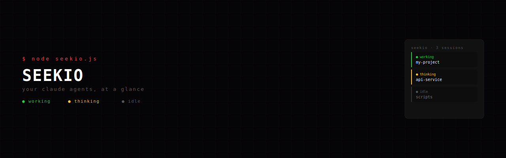

<div align="center">
  
</div>

<br>

<div align="center">

[](https://nodejs.org)
[]()
[](LICENSE)

</div>

## Install & Run

```bash
git clone https://github.com/zarionlabs/seekio.git
cd seekio
node seekio.js
```

Open **http://localhost:3456** in your browser. No dependencies to install.

## What It Does

seekio watches your running Claude Code sessions and shows their status in real time —
working, thinking, or idle — in a terminal dashboard or a pixel art office scene.
Two views, zero setup.

## Options

| Flag | Default | Description |
|------|---------|-------------|
| `--port <n>` | `3456` | Port to listen on |
| `--host <ip>` | `127.0.0.1` | Bind address |

**Access from your phone** (same Wi-Fi):

```bash
node seekio.js --host 0.0.0.0
```

The LAN address is printed at startup. Open it on your device.

## License

MIT
